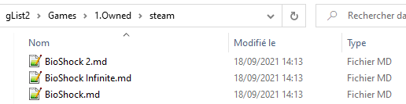

# Markdown helper

Simple script that allows to generate a report from a markdown files managed in a folder tree.
Done to generate report when using very nice application like [Notable](https://www.electronjs.org/apps/notable) or [Obsidian](https://obsidian.md/).
These applications are smart enough to use open and local storage. I do recommend them.

> Ex: gList2 is a folder with lot of markdown files that describe my games and games I follow.
> 
> 
>
> Tools will allow to generate a nice report base on tag or path.
>
> *and yes BioShock is a very good License :-)*

Report generated if based on condition using tag ( #TRUC ) or file path.

# How to use it ?
- Edit $home/.markdownHelper, set up the root path for the markdown files, define the report.
Example [here](example.markdownHelper.json)
> The example is from a list of markdown file where each file is a game sheet with tag to indicate if they have been done or not, category, type, platform, etc...
> The report template seems quite simple to understand with the example so for now, there is no more explanation !

- "target" :  # 1st level only: target file path
- "title" :  # mandatory on each bloc
- "tag_condition" :  # optional: tag list to filter content ( can be tag prefix )
- "path_condition" :  # optional: name list that should be used in folder path
- "contents" :  # sub blocs / in not defined --> leaf to print
- "else" :  # optional: bloc to process all entries not selected by filter``
- "commentTag" : # a comment TAG is a tag that start at the beginning of the line and
                                     # the text on the same line will be registered as a comment and shown in report.
- "showTags" : # tag that start by the requested string will be added to the line

Use ``%TAGNAME%`` in a tag condition with un single tag that define the prefix for a tag. Report will expand this to as many differents tags are detected that match the provided prefix. §title will be the tag name without the prefix.
ex:

    "title": "%TAGNAME%",
    "tag_condition": [ "CAT/" ],

will generate one § by tag prefix by ``CAT/``:
- CAT/STORY-RICH
- CAT/STORY-ACTION
...
- 
- then run the script without option and the report will be generated in target path defined in setup.

Enjoy :-) or Not !! Just provided here because it's quite generic. I don't really expect to be used by anybody else !

> Script trace of python.exe main.py
        
        GhStorage: loaded - version 0
        GhSetup: Configuration loaded
        
        ====
        Obsidian Helper Version DEV
           | Markdown vault: C:\........\gList2
        ====
        C:\\........\gList2
        ...
        ...
        ...
        C:\\........\gList2\_glist\Attachment  
        C:\\........\gList2\_glist\Attachment\GamesPictures   
        1731 files detected
        
        Process finished with exit code 0

       =================
       Processing report full content analysis
       =================

       Generate report to C:\........\gList2\ContentAnalysisReport.md

# Deployment somewhere ?
It's just a simple script... so no.

# Dev env
Open with your favorite python editor and go. It has been developed using PyCharm.

